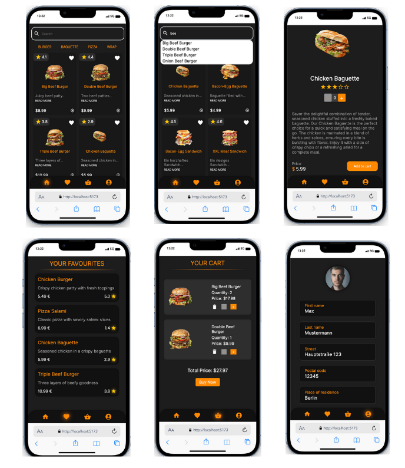

### FoodBro App

The FoodBro App is an application that we created using the knowledge gained from the first part of our web developer full-stack course. After completing the frontend part of the course, we wanted to deepen our understanding and worked on this project after the course and during the weekends.

## How does FoodBro App work?

Uncertain about what to eat after a long day of classes and lacking the motivation to cook for yourself? That's why we developed the FoodBro App. Simply order your meal conveniently from your smartphone.

Here are the functions:

- Browse through our entire menu or search specifically for your favorite dish using the search bar
- Get inspired by searching through categories and find the meal you're craving
- Save your favorite dishes to your favorites and save time searching for them on your next order
- Add the found meal to your cart and enjoy it at the location of your choice

## Tech Stack 💻

- React.js
- Vite
- VS Code
- HTML
- CSS
- JavaScript
- Git
- Trello

## Copatible Screensizes 📱

- Smartphone
- Tablet
- Desktop

## Scrrenshots

## Authors

- [@AdrSpeer](https://github.com/AdrSpeer)
- [@SonoraDE](https://github.com/SonoraDE)
